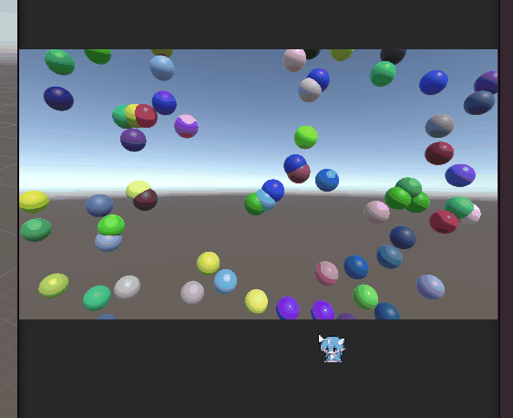
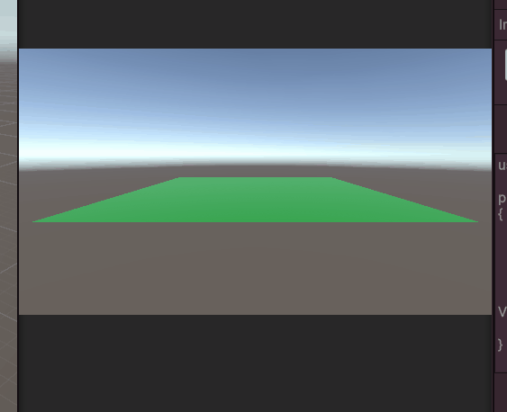
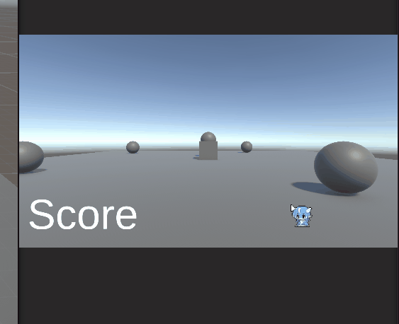
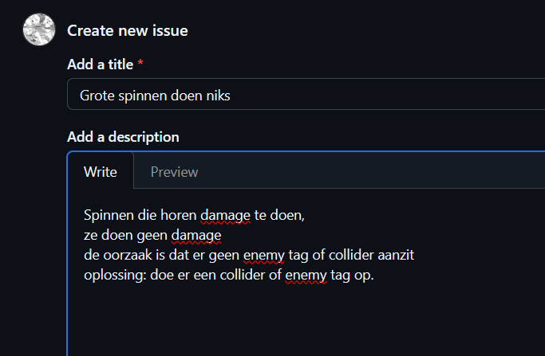
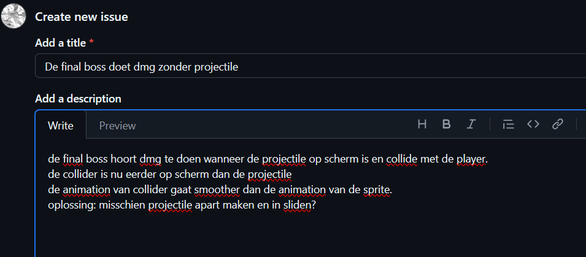
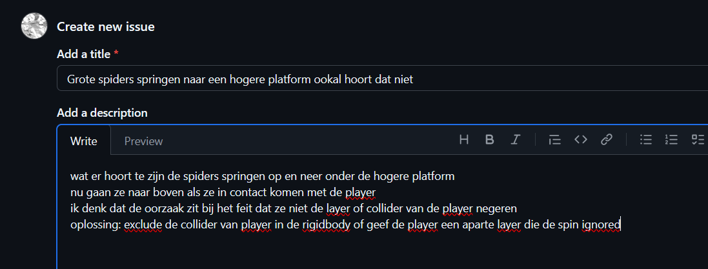
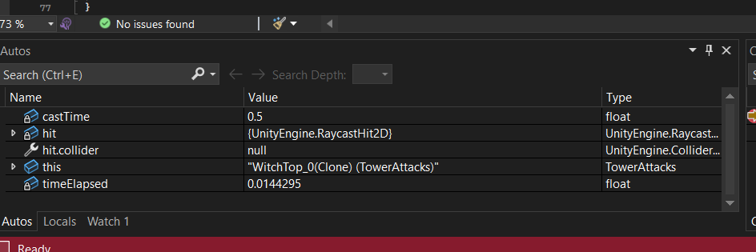
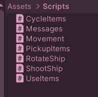

# M5Prog  
# Opdracht 1  
  

Met dit [Script](M5ProgUnity/Assets/Scripts/CreateBall.cs) heb ik ervoor gezorgt dat er een bal spawnt elke paar seconde en daarna na een paar secondes weer weg gaat.
# Opdracht 2  
  

met de scripts hieronder heb ik ervoor gezorgt dat je met een click een random gegenereerde toren spawnt en dat ze op de juiste hoogte staan.  
[Tower script](M5ProgUnity/Assets/Scripts/Tower.cs) || [Tower spawner script](M5ProgUnity/Assets/Scripts/Towerspawner.cs)
# Opdracht 4  

Ik heb met action events scripts gemaakt die score optellen
[Score](M5ProgUnity/Assets/Scripts/Scoreboard.cs) || [Pickup](M5ProgUnity/Assets/Scripts/Pickup.cs)
# Opdracht 5  
Eerst ging ik bugs van Mythe reporten

  
  
  

Daarna heb ik breakpoint getest van mijn tower 

  
# Opdracht 6  

Ik heb een script in meerdere scripts opgesplits en een algemene movement [script](Space48/Assets/Scripts/Movement.cs) gemaakt.

