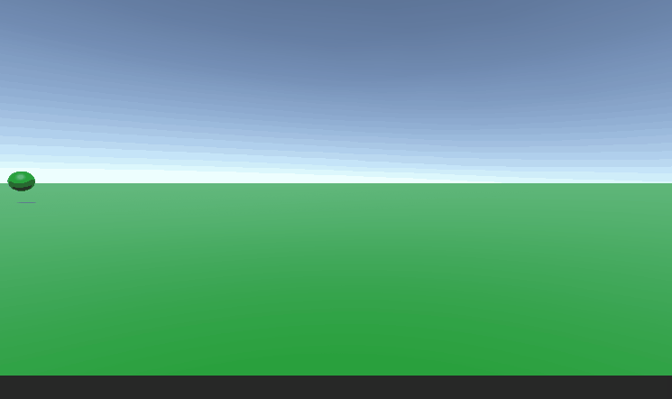
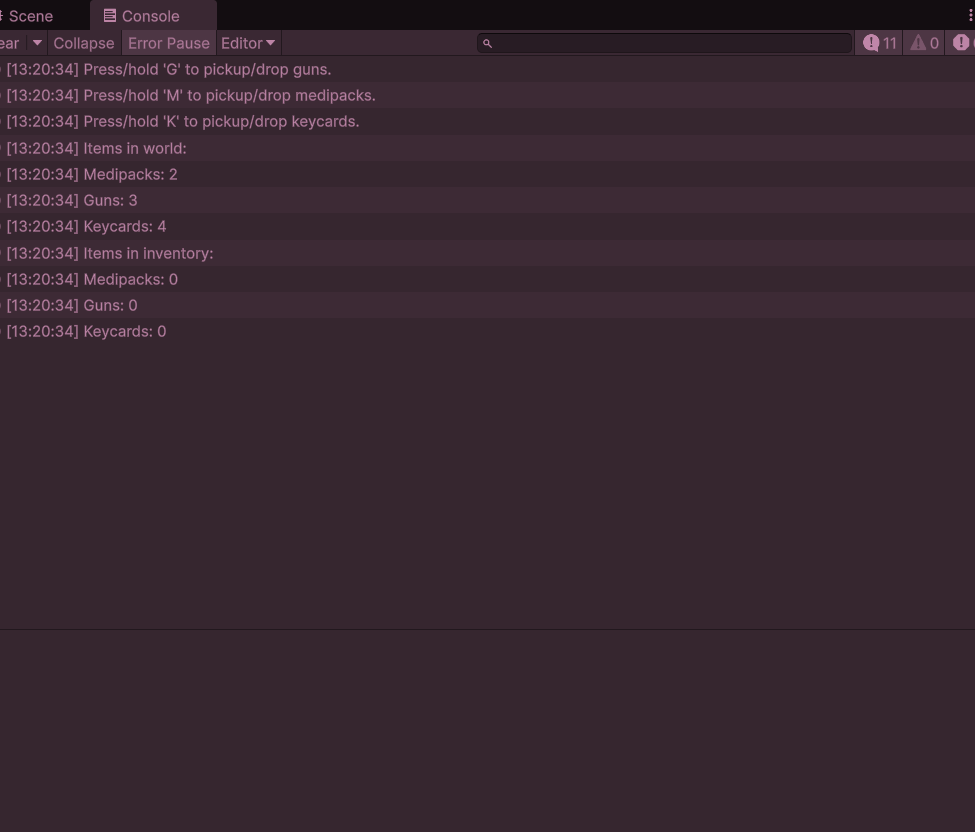
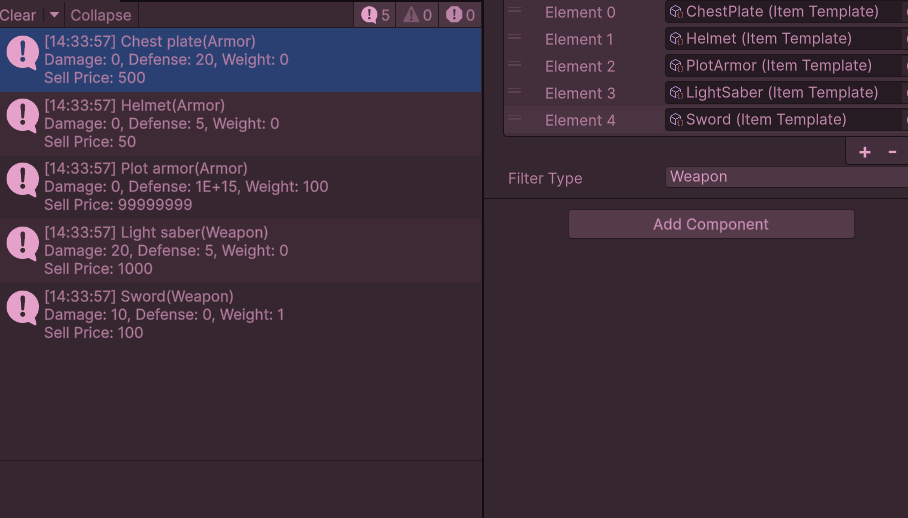
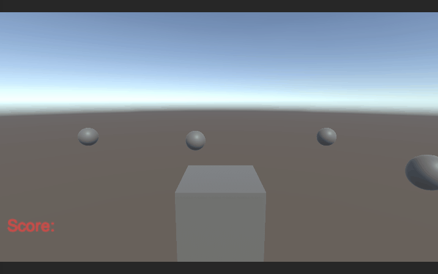
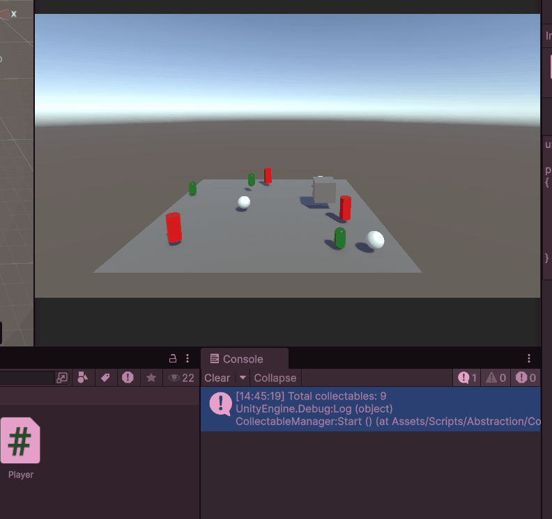

# M5Prog  
# Opdracht 1  
  

Met dit [Script](M5ProgUnity/Assets/Scripts/CreateBall.cs) heb ik ervoor gezorgt dat er een bal spawnt elke paar seconde en daarna na een paar secondes weer weg gaat.
# Opdracht 1A 
  

met de scripts hieronder heb ik ervoor gezorgt dat je met een click een random gegenereerde toren spawnt en dat ze op de juiste hoogte staan.  
[Tower script](M5ProgUnity/Assets/Scripts/Tower.cs) || [Tower spawner script](M5ProgUnity/Assets/Scripts/Towerspawner.cs)
# Opdracht 1B

Met een EnemySpawner [script](M5ProgUnity/Assets/Scripts/EnemySpawner.cs) heb ik ervoor gezorgt dat je [enemies](M5ProgUnity/Assets/Scripts/Enemy.cs) in kan spawnen en met W toets 100 in spawnt en met Q toets alles verwijderd
# Opdracht 2  

Ik heb met action events scripts gemaakt die score optellen
[Score](M5ProgUnity/Assets/Scripts/Scoreboard.cs) || [Pickup](M5ProgUnity/Assets/Scripts/Pickup.cs)
# Opdracht 3 
Eerst ging ik bugs van Mythe reporten

  
  
  

Daarna heb ik breakpoint getest van mijn tower 

  
# Opdracht 4A,4B  

Ik heb een script in meerdere scripts opgesplits en een algemene movement [script](M5ProgUnity/Assets/Scripts/Space48/Movement.cs) gemaakt.
# Opdracht 5

Ik heb met een parent [script](M5ProgUnity/Assets/Scripts/Inheritance/EnemyParent.cs) andere enemies gemaakt zoals een [elf](M5ProgUnity/Assets/Scripts/Inheritance/Elf.cs) en een [brute](M5ProgUnity/Assets/Scripts/Inheritance/Brute.cs) door gebruik te maken van inhertance.
# M6Prog
# Opdracht 1

Ik heb een [itemsysteem](M5ProgUnity/Assets/Scripts/CodeConventions/InventorySystem.cs) gemaakt die bij houdt wat voor soort [items](M5ProgUnity/Assets/Scripts/CodeConventions/InventoryItem.cs) in de scene staan  

[Gun](M5ProgUnity/Assets/Scripts/CodeConventions/Gun.cs) |
[Medipack](M5ProgUnity/Assets/Scripts/CodeConventions/Medipack.cs) |
[Keycard](M5ProgUnity/Assets/Scripts/CodeConventions/Keycard.cs)

# Opdracht 2
[Link naar Class diagram](ClassDiagramTD.md)

# Opdracht 3 

Ik heb met data structures gewerkt om verschillende [items](M5ProgUnity/Assets/Scripts/DataStructures/Item.cs) te maken  
[Inventory](M5ProgUnity/Assets/Scripts/DataStructures/Inventory.cs) |
[Template](M5ProgUnity/Assets/Scripts/DataStructures/ItemTemplate.cs) |
[Stats](M5ProgUnity/Assets/Scripts/DataStructures/ItemStats.cs) |
[Type](M5ProgUnity/Assets/Scripts/DataStructures/ItemType.cs)  

[Plot armor](M5ProgUnity/Assets/ScriptableObjects/PlotArmor.asset) |
[Chest plate](M5ProgUnity/Assets/ScriptableObjects/ChestPlate.asset) |
[Helmet](M5ProgUnity/Assets/ScriptableObjects/Helmet.asset) |
[Lightsaber](M5ProgUnity/Assets/ScriptableObjects/LightSaber.asset) |
[Sword](M5ProgUnity/Assets/ScriptableObjects/Sword.asset)
# Opdracht 4

Ik heb ervoor gezorgd dat de [script van opdracht 5](M5ProgUnity/Assets/Scripts/Abstraction/Collectables.cs) werkt met een delegate 

[Scoreboard](M5ProgUnity/Assets/Scripts/Delegates/DelegateScoreboard.cs)
# Opdracht 5

Ik heb verschillende [collectables](M5ProgUnity/Assets/Scripts/Abstraction/Collectables.cs) gemaakt die bijgehouden worden in een [collectable manager](M5ProgUnity/Assets/Scripts/Abstraction/CollectableManager.cs)   

[Coin pickup](M5ProgUnity/Assets/Scripts/Abstraction/CoinPickup.cs) |
[Damage trap](M5ProgUnity/Assets/Scripts/Abstraction/DamageTrap.cs) |
[Health pickup](M5ProgUnity/Assets/Scripts/Abstraction/HealthPickup.cs)
# Opdracht 6

Ik heb met het concept polymorphism gespeeld hier is de 
[enemy base class](M5ProgUnity/Assets/Scripts/Polymorphism/EnemyPoly.cs)
met een [battlemanager](M5ProgUnity/Assets/Scripts/Polymorphism/BattleManager.cs) heb ik de console de uitvoeringen laten printen
en ik heb mijn eigen enemy [witch](M5ProgUnity/Assets/Scripts/Polymorphism/Witch.cs) geimplimenteerd

[Dragon](M5ProgUnity/Assets/Scripts/Polymorphism/Dragon.cs) |
[Goblin](M5ProgUnity/Assets/Scripts/Polymorphism/Goblin.cs) |
[Zombie](M5ProgUnity/Assets/Scripts/Polymorphism/Zombie.cs)

# Opdracht 7 
